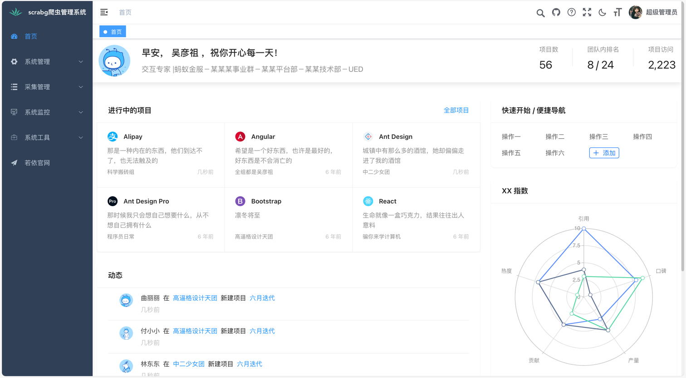
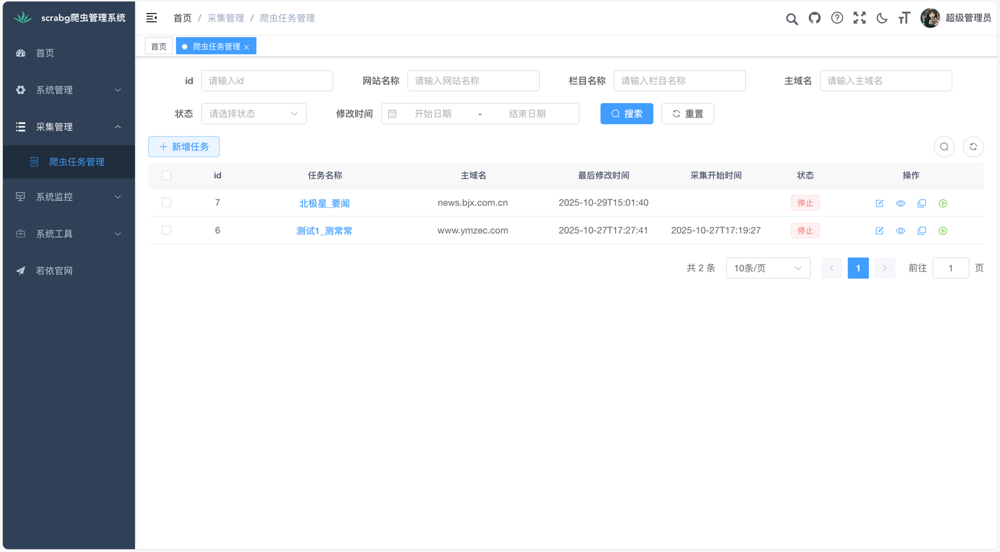
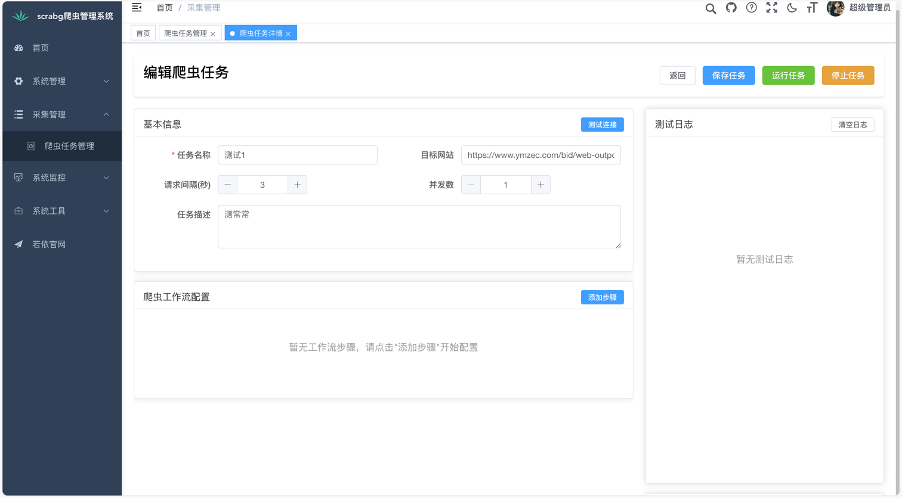
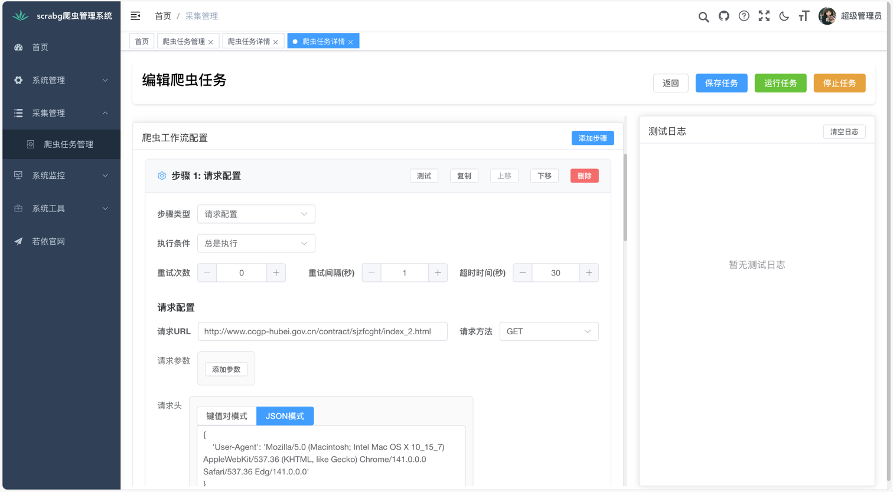
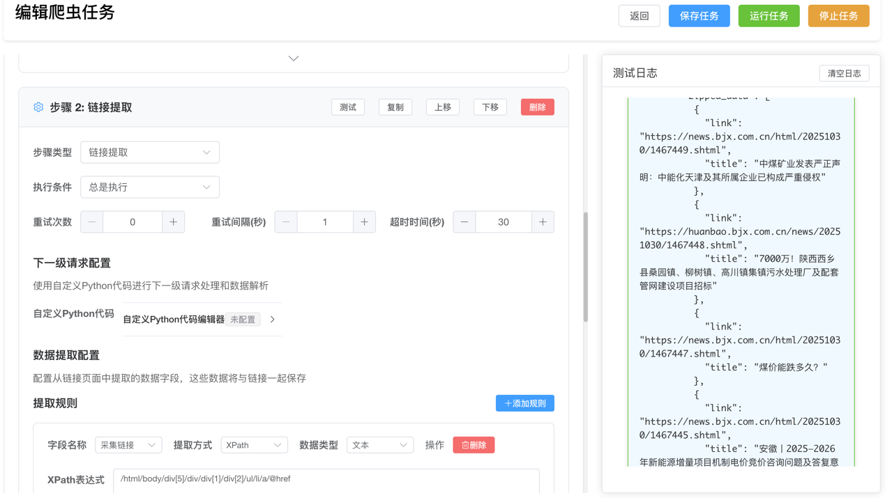
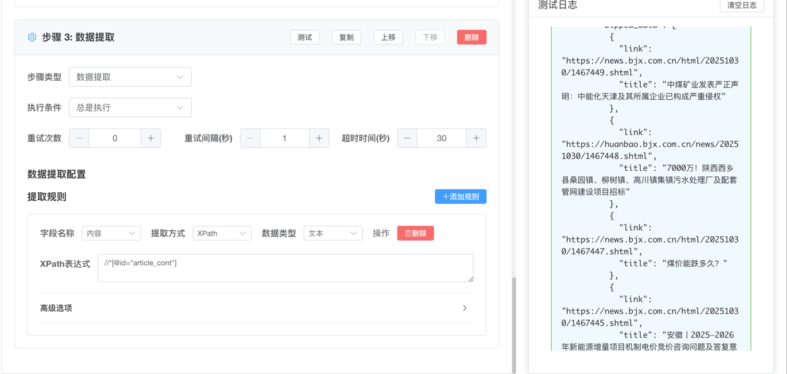

<h1 align="center" style="margin: 30px 0 30px; font-weight: bold;">scra v0.0.1</h1>
<h4 align="center">基于RuoYi-Vue3+FastAPI的智能爬虫管理平台</h4>
<p align="center">
	</a>
	<a href="https://github.com/scrabg/scra"></a>
	<a href="https://github.com/bgspider/bgspider/blob/master/LICENSE"></a>
    
    
    
</p>


## 平台简介

scra是一套基于RuoYi-Vue3-FastAPI开发的智能爬虫管理平台，专注于提供可视化的爬虫配置、管理和监控功能。

### 核心特性

* **可视化配置**：通过Web界面配置爬虫任务，无需编写代码
* **多步骤工作流**：支持请求配置、链接提取、数据提取的完整工作流
* **实时监控**：实时查看爬虫运行状态、成功率和数据提取情况
* **智能引擎**：基于FastAPI的高性能爬虫执行引擎
* **数据管理**：完整的数据存储、查询和导出功能

### 技术栈

* **前端**：Vue3 + Element Plus + Vite
* **后端**：FastAPI + SQLAlchemy + MySQL/PostgreSQL + Redis
* **爬虫引擎**：自研SpiderEngine，支持多线程、队列管理
* **认证**：OAuth2 + JWT多终端认证
* **部署**：Docker容器化部署

## 爬虫功能特色

### 1. 可视化工作流配置
- **请求配置**：支持GET/POST请求、自定义Headers、参数配置
- **链接提取**：CSS选择器、XPath表达式提取链接
- **数据提取**：多字段数据提取，支持文本、属性、HTML内容

### 2. 智能爬虫引擎
- **多线程执行**：可配置并发数，提高采集效率
- **请求队列管理**：智能队列调度，避免服务器压力
- **错误处理**：完善的异常处理和重试机制
- **反爬虫对抗**：支持代理、延时、User-Agent轮换

### 3. 实时监控与管理
- **任务状态监控**：实时查看爬虫运行状态
- **数据统计**：成功率、失败率、数据量统计
- **日志记录**：详细的执行日志和错误信息
- **任务控制**：启动、停止、暂停爬虫任务

### 4. 数据管理
- **结构化存储**：提取的数据自动存储到数据库
- **数据查询**：灵活的数据查询和筛选功能
- **数据导出**：支持JSON、CSV、Excel等格式导出
- **数据清洗**：内置数据清洗和去重功能

## 系统功能

### 爬虫管理模块
1. **任务管理**：创建、编辑、删除爬虫任务
2. **配置管理**：可视化配置爬虫参数和规则
3. **执行监控**：实时监控爬虫执行状态
4. **数据查看**：查看和管理提取的数据
5. **日志分析**：详细的执行日志和错误分析

### 系统管理模块
1. **用户管理**：用户账号管理和权限控制
2. **角色管理**：角色权限分配和数据范围控制
3. **菜单管理**：系统菜单和操作权限配置
4. **部门管理**：组织架构管理
5. **字典管理**：系统字典数据维护
6. **参数管理**：系统参数配置
7. **操作日志**：系统操作记录和审计
8. **定时任务**：定时爬虫任务调度

## 快速开始

### 环境要求
- Python 3.9+
- Node.js 18+
- MySQL 5.7+ 或 PostgreSQL 12+
- Redis 6.0+

### 安装部署

#### 1. 克隆项目
```bash
git clone https://github.com/scrabg/scra.git
cd scra
```

#### 2. 后端部署
```bash
# 进入后端目录
cd backend

# 创建虚拟环境
conda create -n scra python=3.9
conda activate scra

# 安装依赖
pip install -r requirements.txt

# 配置数据库
# 编辑 backend/.env.dev 文件，配置数据库连接信息

# 初始化数据库
# 导入 backend/sql/ruoyi-fastapi.sql 到MySQL数据库

# 启动后端服务
python app.py --env=dev
```

#### 3. 前端部署
```bash
# 进入前端目录
cd frontend

# 安装依赖
yarn install

# 启动开发服务器
yarn dev
```

#### 4. 访问系统
- 前端地址：http://localhost:3200
- 后端API：http://localhost:9099
- 默认账号：admin / admin123
### 实例地址
https://demo.bgspider.com

测试用户名、密码 spider1 / spider1
测试逻辑未上线，仅有前后端交互功能，不保证功能完整性
## 使用指南

### 创建爬虫任务

1. **基础配置**
   - 任务名称：为爬虫任务命名
   - 目标域名：设置要爬取的网站域名
   - 并发数：设置爬虫并发线程数

2. **工作流配置**
   - **步骤1 - 请求配置**：配置HTTP请求参数
   - **步骤2 - 链接提取**：配置链接提取规则
   - **步骤3 - 数据提取**：配置数据字段提取规则

3. **测试与运行**
   - 使用测试功能验证配置
   - 启动爬虫任务开始采集
   - 实时监控采集进度
### 运行截图
登录

首页

任务管理

任务配置




### 配置示例
开发阶段，仅限参考
```json
{
  "workflowSteps": [
    {
      "type": "request",
      "config": {
        "method": "GET",
        "headersJson": "{\"User-Agent\": \"Mozilla/5.0...\"}"
      }
    },
    {
      "type": "link_extraction", 
      "config": {
        "linkExtractionRules": [
          {
            "name": "link",
            "selector": "a",
            "attribute": "href"
          }
        ]
      }
    },
    {
      "type": "data_extraction",
      "config": {
        "extractionRules": [
          {
            "name": "title",
            "selector": "h1",
            "attribute": "text"
          }
        ]
      }
    }
  ]
}
```


## 开发计划

- [ ] 支持更多数据源（API、数据库等）
- [ ] 增加机器学习数据清洗功能
- [ ] 支持分布式爬虫集群
- [ ] 增加数据可视化分析
- [ ] 支持更多反爬虫策略

## 技术支持

如果您在使用过程中遇到问题，可以通过以下方式获取帮助：

1. 查看项目文档和示例
2. 提交Issue到GitHub仓库
3. 加入技术交流群

## 开源协议

本项目基于 [MIT License](LICENSE) 开源协议，您可以自由使用、修改和分发。

## 致谢

- 感谢 [RuoYi-Vue3-FastAPI](https://gitee.com/insistence2022/RuoYi-Vue3-FastAPI) 提供的优秀基础框架
- 感谢 FastAPI 社区提供的高性能Web框架
- 感谢所有为开源社区贡献的开发者们